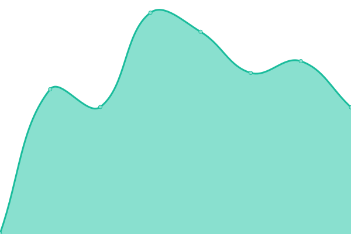
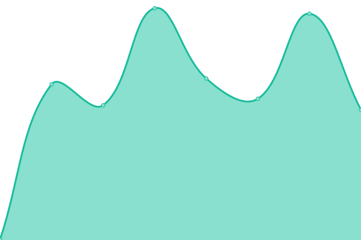
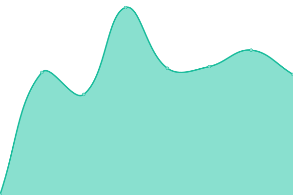

# [📈 Live Status](https://fblacklight-organization.github.io/status): <!--live status--> **🟩 All systems operational**

This repository contains the open-source uptime monitor and status page for [Furry Blacklight](https://fblacklight.org), powered by [Upptime](https://github.com/upptime/upptime).

With [Upptime](https://upptime.js.org), you can get your own unlimited and free uptime monitor and status page, powered entirely by a GitHub repository. We use [Issues](https://github.com/fblacklight-organization/status/issues) as incident reports, [Actions](https://github.com/fblacklight-organization/status/actions) as uptime monitors, and [Pages](https://fblacklight-organization.github.io/status) for the status page.

<!--start: status pages-->
<!-- This summary is generated by Upptime (https://github.com/upptime/upptime) -->
<!-- Do not edit this manually, your changes will be overwritten -->
<!-- prettier-ignore -->
| URL | Status | History | Response Time | Uptime |
| --- | ------ | ------- | ------------- | ------ |
|  [Landing Page](https://www.fblacklight.org/en) | 🟩 Up | [landing-page.yml](https://github.com/fblacklight-organization/status/commits/HEAD/history/landing-page.yml) | 

 537ms
     
 | 

<a href="https://status.fblacklight.org/history/landing-page">98.94%</a>
    

|  [Registration](https://registration.fblacklight.org) | 🟩 Up | [registration.yml](https://github.com/fblacklight-organization/status/commits/HEAD/history/registration.yml) | 

 465ms
     
 | 

<a href="https://status.fblacklight.org/history/registration">98.67%</a>
    

|  [Apps Hub](https://apps.fblacklight.org) | 🟩 Up | [apps-hub.yml](https://github.com/fblacklight-organization/status/commits/HEAD/history/apps-hub.yml) | 

 432ms
     
 | 

<a href="https://status.fblacklight.org/history/apps-hub">98.91%</a>
    

|  [Companion App](https://companion.fblacklight.org) | 🟩 Up | [companion-app.yml](https://github.com/fblacklight-organization/status/commits/HEAD/history/companion-app.yml) | 

 424ms
     
 | 

<a href="https://status.fblacklight.org/history/companion-app">98.89%</a>
    

|  Authentication Service | 🟩 Up | [authentication-service.yml](https://github.com/fblacklight-organization/status/commits/HEAD/history/authentication-service.yml) | 

 381ms
     
 | 

<a href="https://status.fblacklight.org/history/authentication-service">98.70%</a>
    

|  Riddle Services | 🟩 Up | [riddle-services.yml](https://github.com/fblacklight-organization/status/commits/HEAD/history/riddle-services.yml) | 

 398ms
     
 | 

<a href="https://status.fblacklight.org/history/riddle-services">98.71%</a>
    

|  Virtual Queues | 🟩 Up | [virtual-queues.yml](https://github.com/fblacklight-organization/status/commits/HEAD/history/virtual-queues.yml) | 

 391ms
     
 | 

<a href="https://status.fblacklight.org/history/virtual-queues">98.72%</a>
    

|  Data Services | 🟩 Up | [data-services.yml](https://github.com/fblacklight-organization/status/commits/HEAD/history/data-services.yml) | 

 530ms
     
 | 

<a href="https://status.fblacklight.org/history/data-services">98.61%</a>
    

<!--end: status pages-->

[**Visit our status website →**](https://fblacklight-organization.github.io/status)

## 📄 License

- Powered by: [Upptime](https://github.com/upptime/upptime)
- Code: [MIT](./LICENSE) © [Anand Chowdhary](https://anandchowdhary.com), supported by [Pabio](https://pabio.com)
- Data in the `./history` directory: [Open Database License](https://opendatacommons.org/licenses/odbl/1-0/)
